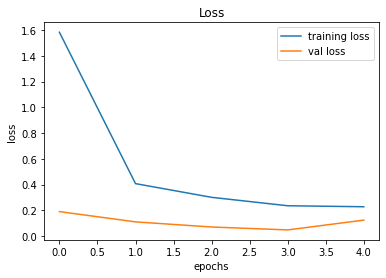

# Traffic-Sign-Recognition using CNN

With the increasing popularity of self driving cars and driving assistance systems the need for applications which perform Traffic Sign Recognition is ever increasing, with the help of this project the aim is to train a Convolutional Neural Network (CNN) for Traffic Sign Recognition using keras library  the model implementation will be done using images from the GTSRB - German Traffic Sign Recognition Benchmark dataset. The possibilities of a traffic sign recognition system are endless with its integration in driving systems, pedestrian assistance and an educative way to make the public aware of the various traffic signs.

Let us dive into the specifics of this project, the implementation can be vieweed as four sections:
1. Dataset
2. CNN model
3. Methodology
4. Results

## Dataset

As mentioned above the dataset used is GTSRB - German Traffic Sign Recognition Benchmark dataset. [link](https://www.kaggle.com/datasets/meowmeowmeowmeowmeow/gtsrb-german-traffic-sign)
The dataset has the following properties:
- Single-image, multi-class classification problem
- More than 40 classes
- More than 50,000 images in total
- Large, lifelike database

The dataset includes almost 50,000 photos of various traffic signals. It is further divided into 43 distinct categories. The collection is highly diverse, with some classes containing numerous photos and others containing few. The dataset is 642 MB in size. The dataset has a train folder with photographs for each class and a test folder that will be utilized to test our model. The format of the images is png.
Some sample images from the dataset are: 

    

## CNN model

A type of feed-forward neural network is called a convolutional network, CNN. A CNN analyses visual images by processing data in a grid-like architecture. It is also referred to as a ConvNet. To find and categorise items in an image, a convolutional neural network is employed and also makes it its main usecase.
There are different layers used in a CNN like:
- pooling
- dense 
- flatten
- conv
- dropout

The CNN model used in the implementation of this project uses the following layers are as described in the following two images:
 1. Model Summary

    

2. Model Architecture

    

## Methodology

The methodology of the project is very straightforward and can be summarised as a list:
1. Importing necessary libraries and dependencies
<pre><code>
import numpy as np 
import pandas as pd 
import matplotlib.pyplot as plt
import cv2
import tensorflow as tf
from PIL import Image
import PIL.Image
import os
from sklearn.model_selection import train_test_split
from keras.utils import to_categorical
from keras.models import Sequential, load_model
from keras.layers import Conv2D, MaxPool2D, Dense, Flatten, Dropout
</code></pre>

2. Loading the dataset, retrieving the images and labels
3. Converting lists into numpy arrays
<pre><code>
data = np.array(data)
labels = np.array(labels)
print(data.shape, labels.shape)
</code></pre>
4. Splitting training and testing dataset
<pre><code>
X_train, X_test, y_train, y_test = train_test_split(data, labels, test_size=0.2, random_state=42)
</code></pre>
5. Converting labels into one hot encoding
<pre><code>
y_train = to_categorical(y_train, 43)
y_test = to_categorical(y_test, 43)
</code></pre>
6. Building the model
7. Compiling the model (as seen in the above section, CNN model)
8. Model Training
<pre><code>
epochs = 5
history = model.fit(X_train, y_train, batch_size=32, epochs=epochs, validation_data=(X_test, y_test))
model.save("my_model.h5")
</code></pre>
9. Visualisng results as graphs and accuracy (discussed in the section below)
10. Classifying images and viweing results

## Results

The Matplotlib library is used to visualise the results.
The accuracy and loss plots are plotted.

    

    

The model is tested on the test dataset using:
<pre><code>
from sklearn.metrics import accuracy_score
y_test = pd.read_csv('Test.csv')
labels = y_test["ClassId"].values
imgs = y_test["Path"].values
data=[]
for img in imgs:
    image = Image.open(img)
    image = image.resize((30,30))
    data.append(np.array(image))
X_test=np.array(data)
#pred = model.predict_classes(X_test)
predict_x=model.predict(X_test) 
classes_x=np.argmax(predict_x,axis=1)
#Accuracy with the test data
from sklearn.metrics import accuracy_score
print(accuracy_score(labels, classes_x))
</code></pre>
The accuracy score acheived is **0.928424386381631**

For visualisng the results, a classify function is defined and a dictionary of all the 43 label with their index and the sign they respresent is defined. 

The results can be visualised as:

    

